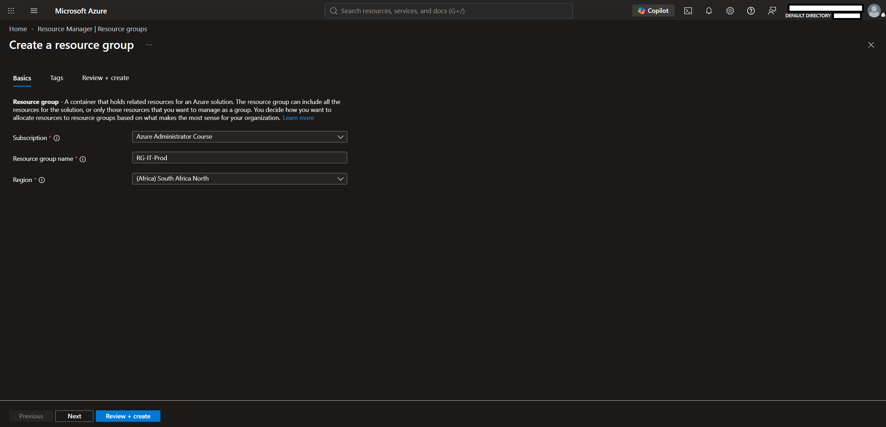
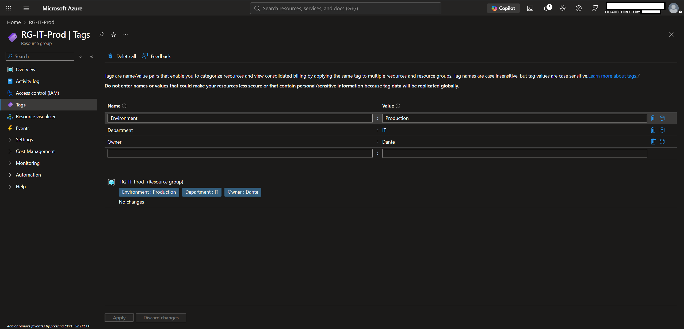
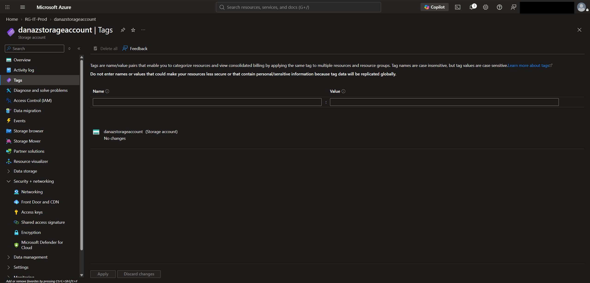
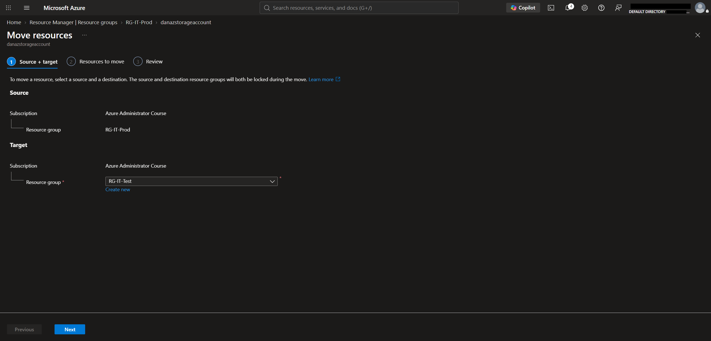
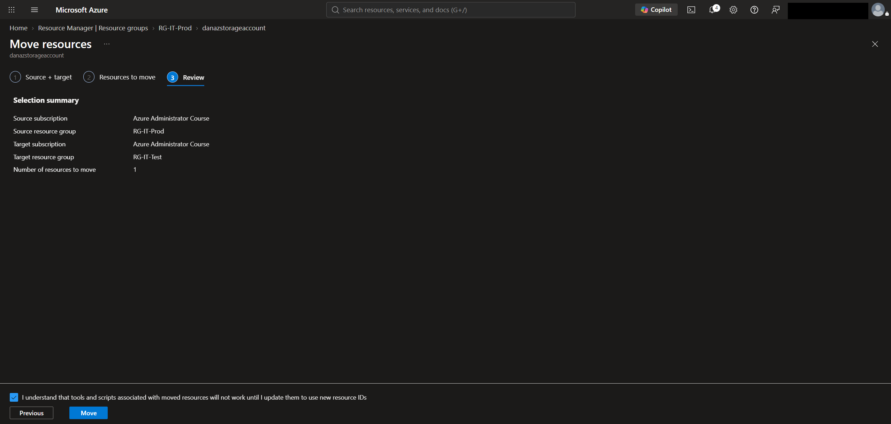
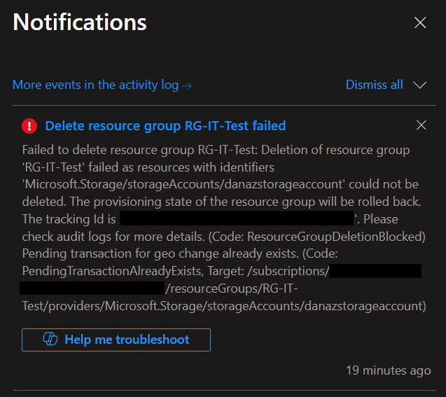
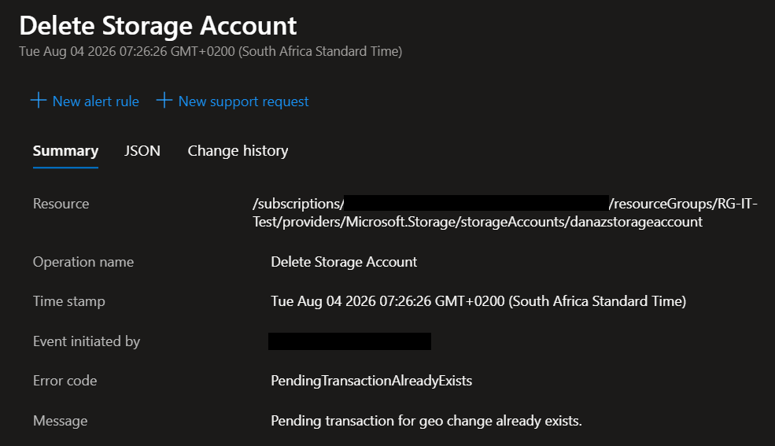

# Lab 01 – Resource Groups

## Objective

Learn how to create, manage and organize Azure resources using Resource Groups.

## Technologies

- Azure Resource Groups
- Azure Storage Account
- Azure Tags

## Lab Tasks

- [x] Create a Resource Group
- [x] Create a Storage Account
- [x] Apply Tags
- [x] Move the Storage Account to another Resource Group
- [x] Delete the Resource Groups

## Architecture

```text
Subscription
│
├── RG-IT-Prod
│     └── Storage Account
│
└── RG-IT-Test
```


---


## Lab Steps

### Step 1 – Create Resource Group

Created a Resource Group named **RG-IT-Prod** in the South Africa North region.




---


### Step 2 – Create Storage Account

Created a Standard Storage Account inside **RG-IT-Prod**.


---


### Step 3 – Apply Tags

Applied the following tags:

| Tag | Value |
|-----|-------|
| Environment | Production |
| Department | IT |
| Owner | Dan |


### Additional Observation:
Also observed that Tags **do not** inherit to child resources, ie. the Storage Account after applying them to the Resource Group: 




---


### Step 4 – Move Resource

Moved the Storage Account from **RG-IT-Prod** to **RG-IT-Test**.



### Review Screen before moving Storage Account:


---


### Step 5 – Delete Resource Groups

Deleted **RG-IT-Prod**.

Attempted to delete **RG-IT-Test**.

Azure initially prevented deletion because the Storage Account had a pending geo-redundancy change.




---


## Troubleshooting

### Issue

Resource Group deletion failed with the following error:

- `ResourceGroupDeletionBlocked`
- `PendingTransactionAlreadyExists`



### Cause

The Storage Account redundancy had just been changed from **RA-GRS** to **LRS**, triggering a backend geo-replication update. Azure blocked the Resource Group deletion until that operation completed.

### Resolution

Waited for the Storage Account provisioning/replication update to finish, then retried the Resource Group deletion successfully.

### Observation

Attempting to delete a Resource Group can fail if one of its resources has a pending management operation (such as changing Storage Account redundancy). Azure rolls back the Resource Group deletion until the operation completes.

---

## Lessons Learned

- A Resource Group is a **logical container** used to organize and manage Azure resources. It does **not** determine the region where resources are deployed.
- Resources within the same Resource Group can exist in **different Azure regions**.
- A resource can belong to **only one Resource Group** at a time.
- Deleting a Resource Group deletes **all resources currently contained within it**.
- Tags applied to a Resource Group are **not inherited** by its resources. Tags must be applied separately unless Azure Policy is used.
- Azure resources, such as Storage Accounts, can be moved between Resource Groups within the same subscription, provided the resource type supports move operations.
- Storage Accounts can also be moved between subscriptions **if both subscriptions belong to the same Microsoft Entra ID tenant** and the resource supports cross-subscription moves.
- Moving a Storage Account to another Resource Group or subscription **does not change its Azure region**.
- A Storage Account **cannot** be moved directly to another Azure region. To change regions, a new Storage Account must be created in the target region and the data migrated.
- Azure management operations are often **asynchronous**. Even after an operation appears complete in the Azure portal, backend processing may still be occurring.
- Azure blocks certain management operations, such as deleting a Resource Group, while a contained resource has a pending operation (e.g., changing Storage Account redundancy).
- The error `PendingTransactionAlreadyExists` indicates that Azure is still processing a previous management operation and the requested action should be retried once it completes.
