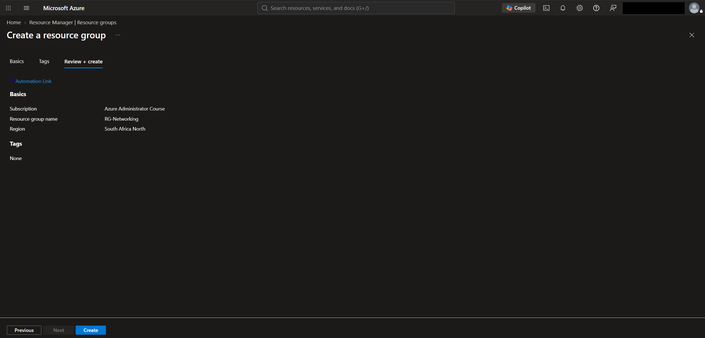
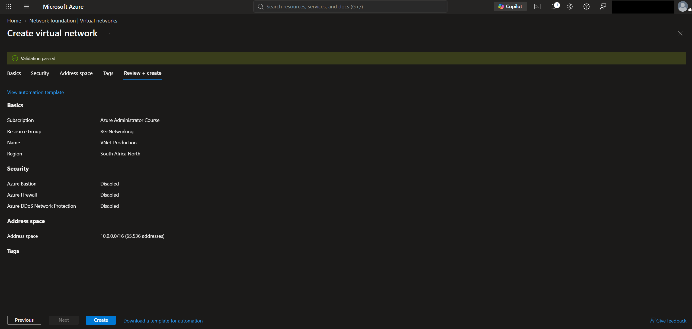
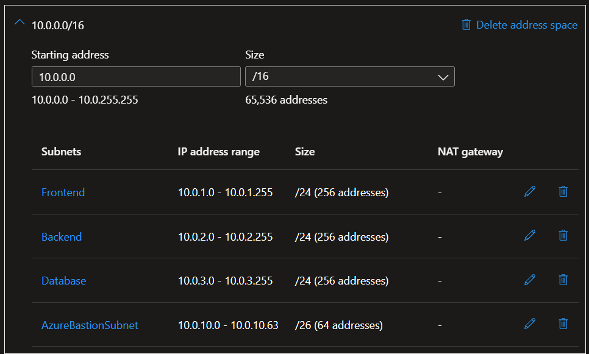
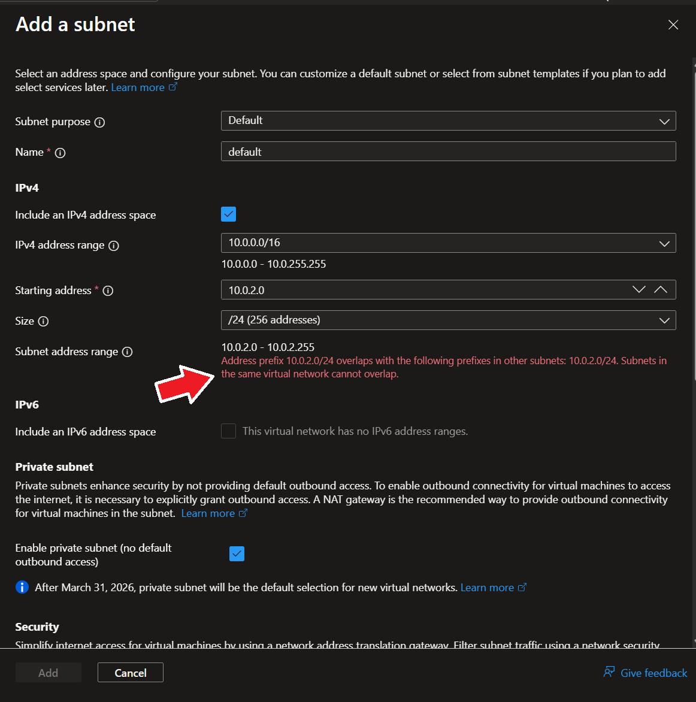
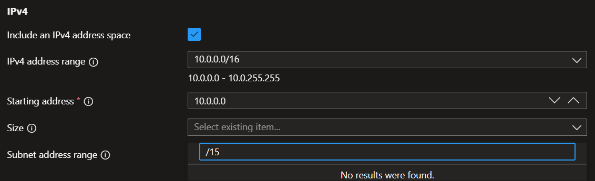
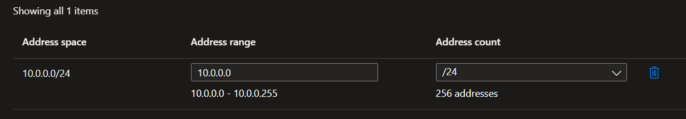
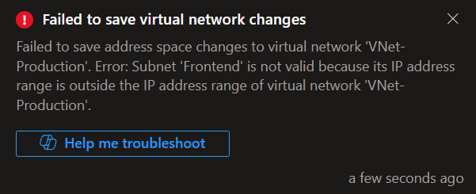

# Lab 02 – Virtual Networks

## Objective

Learn how to create and configure Azure Virtual Networks (VNets), design address spaces and subnets, and understand how Azure resources communicate within a private network.

---

## Prerequisites

- Azure Subscription
- Azure Portal
- Resource Group

---

## Technologies

- Azure Virtual Networks (VNets)
- Azure Subnets
- CIDR Addressing
- Azure Portal

---

## Lab Tasks

- [x] Create a Resource Group
- [x] Create a Virtual Network
- [x] Configure the VNet Address Space
- [x] Create Multiple Subnets
- [x] Explore VNet Configuration
- [x] Perform Networking Experiments

---

## Architecture

```text
Subscription
│
└── RG-Networking
      │
      └── VNet-Production (10.0.0.0/16)
             │
             ├── Frontend
             │      10.0.1.0/24
             │
             ├── Backend
             │      10.0.2.0/24
             │
             ├── Database
             │      10.0.3.0/24
             │
             └── AzureBastionSubnet
                    10.0.10.0/26
```

---

# Lab Steps

## Step 1 – Create Resource Group

Created a Resource Group named **RG-Networking** in **South Africa North**.



---

## Step 2 – Create Virtual Network

Created a Virtual Network named **VNet-Production** with an Address Space of **10.0.0.0/16**.



---

## Step 3 – Create Subnets

Created the following subnets:

| Subnet | Address Prefix |
|---------|---------------|
| Frontend | 10.0.1.0/24 |
| Backend | 10.0.2.0/24 |
| Database | 10.0.3.0/24 |
| AzureBastionSubnet | 10.0.10.0/26 |



### Interesting Observation

While adding a subnet, Azure provides a predefined option for **Azure Bastion**. Selecting this option automatically:

- Sets the subnet name to **AzureBastionSubnet** (the required name for Azure Bastion deployments).
- Suggests an appropriate address prefix (for example, **10.0.10.0/26**) within the Virtual Network address space.

This helps ensure the subnet meets Azure Bastion deployment requirements and reduces the chance of configuration errors.

---

## Step 4 – Explore the Virtual Network

Reviewed the Virtual Network configuration including:

- Address Space
- Subnets
- DNS Servers
- Peerings
- Connected Devices

---

# Experiments

## Experiment 1 – Duplicate Subnet

Attempted to create another subnet using the existing prefix:

**10.0.2.0/24**

### Observation

Azure rejected the configuration because subnet address ranges cannot overlap within the same Virtual Network.



---

## Experiment 2 – Create a Larger Subnet

Attempted to create a subnet using:

**10.0.0.0/15**

### Observation

Azure did not allow a **/15** subnet because it would exceed the Virtual Network's **10.0.0.0/16** Address Space. The **/15** prefix was not available for selection in the Azure Portal.



### Lesson Learned

A subnet must always fit completely within the Virtual Network Address Space and cannot be larger than the VNet itself.

---

## Experiment 3 – Reduce the VNet Address Space

Attempted to reduce the Address Space from:

- **10.0.0.0/16**
- to **10.0.0.0/24**

### Observation

Azure rejected the change because the existing subnets no longer fit within the proposed Address Space. Azure validates that every subnet remains within the Virtual Network Address Space before allowing changes.

The Address Space was then changed to:

**10.0.0.0/18**

which Azure accepted.



The following notification confirms that Azure rejected the Address Space modification because one or more existing subnets would fall outside the proposed VNet Address Space.




---

## Experiment 4 – Recreate a Subnet

Deleted the **Backend** subnet and recreated it using a different Address Prefix.

### Observation

Azure successfully created the subnet because the new Address Prefix:

- Was contained within the VNet Address Space.
- Did not overlap with any existing subnet.

---

## Lessons Learned

- A Virtual Network provides private network connectivity for Azure resources.
- A VNet can contain multiple subnets.
- Subnets cannot overlap.
- Every subnet must fit completely within the Virtual Network Address Space.
- Azure reserves five IP addresses in every subnet.
- VNets can contain multiple Address Spaces.
- Azure validates Address Space changes before applying them.
- Existing subnets must remain inside the Virtual Network after any Address Space modification.
- Address Prefix refers to the network address and CIDR notation assigned to a subnet.
- Proper network planning helps avoid future Address Space conflicts.
- Azure validates subnet configurations before applying network changes.
- A Virtual Network's Address Space can be expanded or reduced only if all existing subnets remain within the new Address Space.

## References

- Microsoft Learn – AZ-104: Configure Virtual Networks
- Azure Virtual Network Documentation
- Azure Subnet Documentation

---

