# Lab 03 – Linux Virtual Machine

## 🎯 Objective

Deploy and configure a Linux Virtual Machine in Azure, understand the resources that support the VM, connect securely using SSH, and explore VM lifecycle, networking, resizing, and resource dependencies.

---

## Prerequisites

- Azure Subscription
- Azure Portal
- Existing Virtual Network from Lab 02
- Azure Cloud Shell
- SSH key pair

---

## Technologies

- Azure Virtual Machines
- Linux / Ubuntu
- Azure Virtual Network
- Azure Subnets
- Network Interface (NIC)
- Public IP Address
- Network Security Group (NSG)
- Managed Disks
- SSH
- Azure Cloud Shell

---

## Lab Tasks

- [x] Deploy a Linux Virtual Machine
- [x] Configure the VM to use the existing VNet
- [x] Place the VM in the Frontend subnet
- [x] Configure SSH key authentication
- [x] Connect to the VM using SSH
- [x] Explore the VM's supporting resources
- [x] Test VM stop and deallocation behavior
- [x] Resize the VM
- [x] Test resource dependencies
- [x] Delete the VM and inspect remaining resources

---

## 🏗️ Architecture

```text
Subscription
│
└── RG-Networking
      │
      ├── VNet-Production
      │      │
      │      └── Frontend (10.0.1.0/24)
      │               │
      │               └── LinuxVM01
      │                      │
      │                      ├── Network Interface
      │                      ├── Private IP
      │                      ├── Public IP
      │                      ├── Network Security Group
      │                      ├── Managed OS Disk
      │                      └── SSH Key
      │
      └── Other subnets from Lab 02
```
---

# 🚀 Lab Steps

## Step 1 – Create Linux Virtual Machine

Created a Linux Virtual Machine named LinuxVM01 using an Ubuntu Linux image.

The VM was deployed into the existing RG-Networking Resource Group and connected to the VNet-Production Virtual Network created in Lab 02.

The VM was placed in the Frontend subnet:
```bash
10.0.1.0/24
```
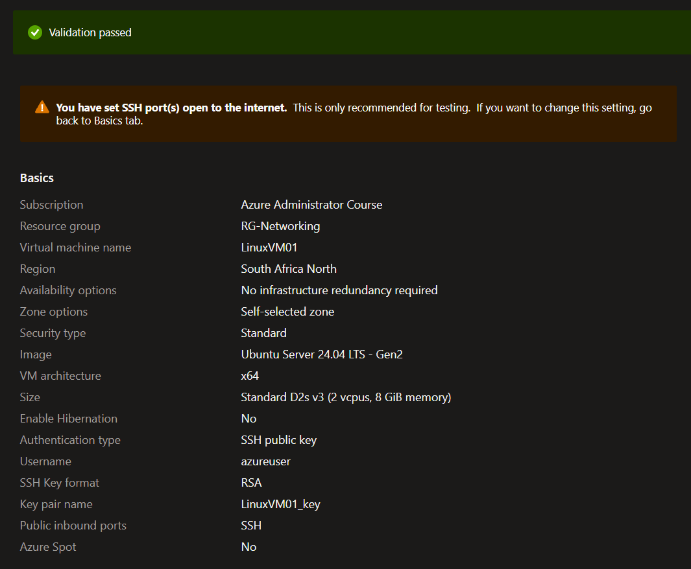

### 💡 Interesting Observation

The originally planned Standard_B1s VM size was unavailable in the selected region (South Africa North). A Standard_D2s_v3 size was used instead.

This demonstrated that VM SKU availability can vary depending on the Azure region and subscription.

---

## Step 2 – Explore VM Resources

After deployment, the VM was inspected along with the resources associated with it.

The following resources were identified:

- Virtual Machine
- Network Interface
- Private IP Address
- Public IP Address
- Network Security Group
- Managed OS Disk
- SSH Key

---

## Step 3 – Explore the Network Interface

Inspected the Network Interface associated with LinuxVM01.

The NIC was connected to:

- VNet-Production
- Frontend subnet
- Private IP configuration
- Network Security Group

The VM's private IP was assigned from the 10.0.1.0/24 subnet.

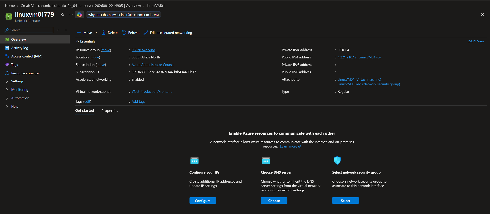

---

## Step 4 – Explore the Public IP

Inspected the Public IP associated with LinuxVM01.

The Public IP was used to provide external connectivity to the VM and was used for the SSH connection.

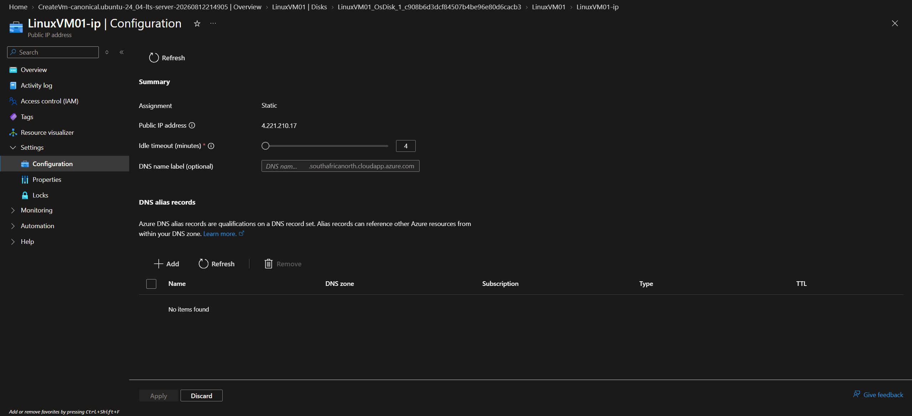

---

## Step 5 – Explore the Managed Disk

Inspected the managed OS disk attached to the VM.

The managed disk provides persistent storage for the VM's operating system.

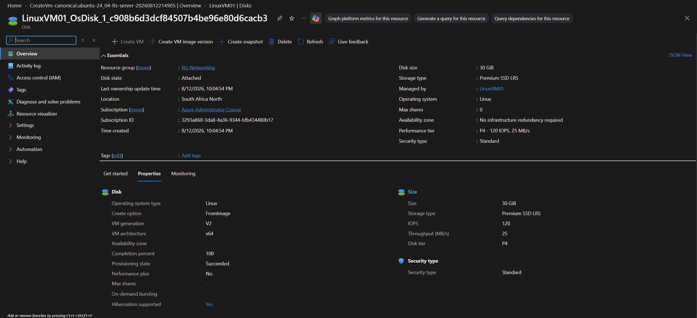

---

## Step 6 – Connect Using SSH

The VM was configured to use SSH public key authentication. Port 22 was allowed through the VM's Network Security Group to permit SSH connectivity.

The private .pem key generated during VM creation was uploaded to Azure Cloud Shell.

The key permissions were then restricted:
```bash 
chmod 600 ~/LinuxVM01-key.pem
```

The VM was accessed using:
```bash
ssh -i ~/LinuxVM01-key.pem azureuser@4.221.210.17
```

### 💡 Interesting Observation

Initially attempting to connect using:
```bash
ssh azureuser@4.221.210.17
```

resulted in:
```bash
Permission denied (publickey)
```

The Cloud Shell environment only contained known_hosts and did not contain the required private SSH key.

Providing the private key explicitly with the -i parameter allowed the connection to succeed.

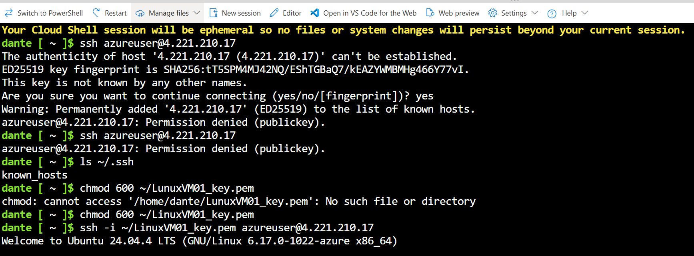

---

## Step 7 – Linux Command-Line Tests

After connecting to the VM, several commands were used to verify the Linux environment.

## Check hostname 

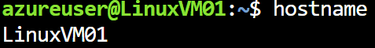


## Check network interfaces

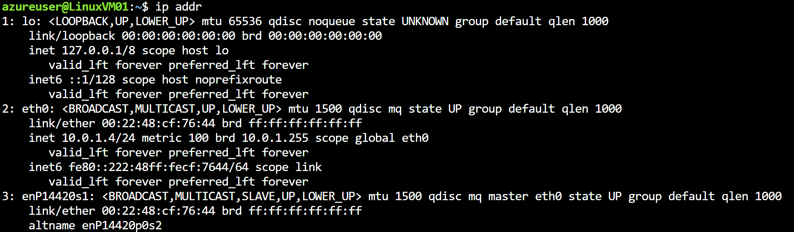


## Check disk layout

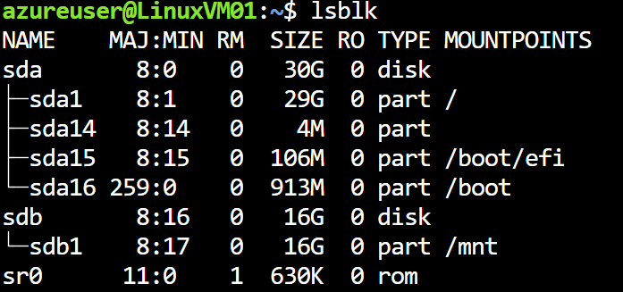


## Check filesystem usage

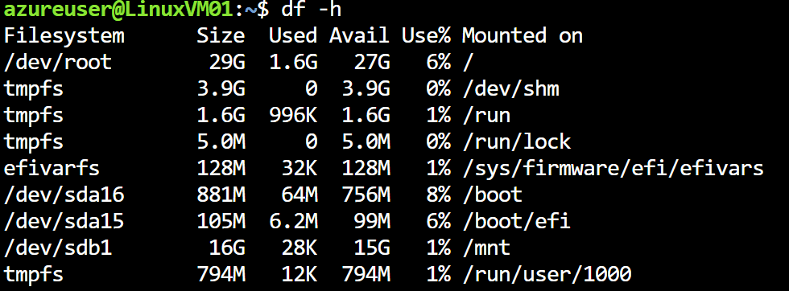

These commands verified the VM's networking configuration, storage, and Internet connectivity.

---


# 🧪 Experiments

## Experiment 1 – Stop and Deallocate the VM

The VM was stopped using the Stop option in the Azure Portal.

### Observation

Azure's Stop operation performed a deallocation of the VM.

The Azure Portal displayed a message stating that deallocating the VM stops charges for its compute resources, while underlying resources such as storage and networking can continue to incur charges.

### Lesson Learned

A VM in a Stopped (deallocated) state no longer incurs compute charges, but associated resources such as managed disks and networking resources may still incur charges.

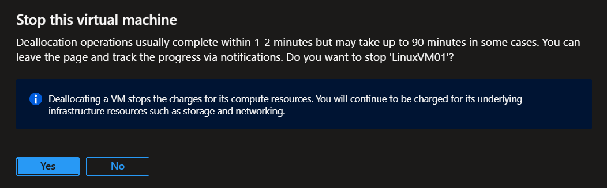

---

## Experiment 2 – Shut Down the VM from Linux

After restarting the VM, it was shut down from inside the operating system via cloud shell using:
```bash
sudo shutdown now
```

### Observation

The VM entered a Stopped state rather than the Stopped (deallocated) state produced by the Azure Portal Stop operation.

### Lesson Learned

Stopping a VM from inside the operating system is different from Azure deallocating the VM.

For cost savings, the VM should be Stopped (deallocated) so that compute resources are released.

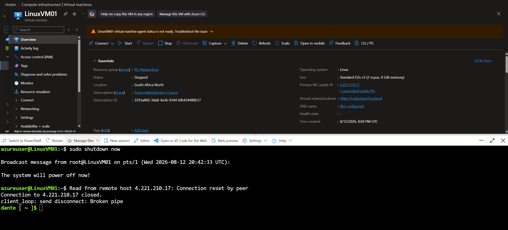

---

## Experiment 3 – Resize the VM

The VM was resized while it was **stopped** and again while it was **running**.

### Observation – VM Stopped

The VM size was successfully changed while the VM was stopped, without requiring a restart.

The VM was then started and the new VM size was applied successfully.

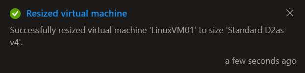

### Observation – VM Running

The VM was then resized while it was running.

Azure indicated that the VM needed to be **restarted** to complete the resize operation.

The resize was subsequently completed successfully after the restart.

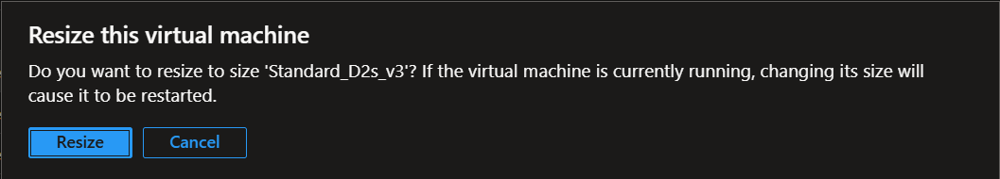

### 💡 Interesting Observation

The VM could be resized without an additional restart when it was already stopped. When the VM was running, Azure required a restart to apply the new VM size.


### Lesson Learned

VM sizes can be changed after deployment. Depending on the circumstances, resizing a running VM may require a restart.

---

## Experiment 4 – Test Network Interface Dependency

Attempted to delete the Network Interface while LinuxVM01 still existed.

### Observation

Azure prevented the deletion because the Network Interface was still associated with the VM.

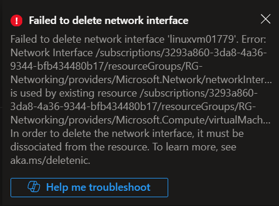

### Lesson Learned

Azure enforces resource dependencies. A Network Interface that is still attached to a VM cannot be independently deleted.

---

## Experiment 5 – Delete the Virtual Machine

Deleted LinuxVM01 and then inspected the remaining resources in the Resource Group.

### Observation

The following resources remained:

- Public IP
- Network Security Group
- Network Interface
- SSH Key
- VNet-Production

The VM's OS disk was also removed as part of the VM deletion in this deployment.

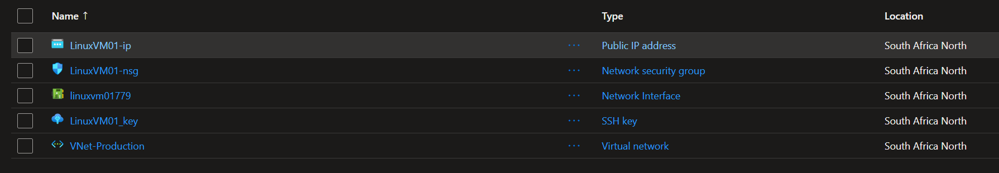

#### 💡 Interesting Observation

Deleting the Virtual Machine did not automatically remove all associated resources.

The networking and authentication resources remained independently available in the Resource Group.

### Lesson Learned

A VM deployment consists of multiple Azure resources with their own lifecycle. Deleting the VM does not necessarily mean that every associated resource is automatically removed.

This is important for cost management, as unused resources such as Public IP addresses or disks may continue to incur charges after a VM has been deleted.

---

# 🛠️ Troubleshooting

## SSH Authentication Failure

### Issue

Attempting to connect using:
```bash
ssh azureuser@4.221.210.17
```

returned:
```bash
Permission denied (publickey)
```

### Cause

The VM was configured for SSH key authentication, but the corresponding private key was not available in Azure Cloud Shell.

### Resolution

Uploaded the .pem private key to Cloud Shell and connected using:
```bash
ssh -i ~/LinuxVM01-key.pem azureuser@4.221.210.17
```

The private key permissions were also restricted using:
```bash
chmod 600 ~/LinuxVM01-key.pem
```

# 📚 Lessons Learned

- An Azure Virtual Machine consists of multiple supporting resources.
- VM SKU availability can vary by Azure region and subscription.
- A VM can be connected to an existing VNet and subnet.
- A Network Interface connects the VM to its Virtual Network.
- A VM can have both a private IP and a public IP.
- Network Security Groups can be associated with the VM's network interface.
- Azure VMs can use SSH public key authentication instead of passwords.
- The private SSH key must be available to the SSH client when connecting.
- Stopped and Stopped (deallocated) are different VM states.
- Deallocating a VM stops compute charges, but associated infrastructure can continue to incur charges.
- VM sizes can be changed after deployment.
- Resizing a running VM may require a restart.
- Azure enforces dependencies between resources.
- A Network Interface cannot be deleted while it is still associated with a VM.
- Deleting a VM does not necessarily delete all associated resources.
- Remaining resources should be reviewed after deleting temporary lab infrastructure to avoid unnecessary costs.

# 💰 Cost Considerations

The VM used a **Standard_D2s_v3** size because the planned **B1s** size was unavailable.
The VM was stopped/deallocated after testing to avoid ongoing compute charges.
Associated resources should also be reviewed and removed when they are no longer required.


