# Lab 04 – Network Security Groups

## 🎯 Objective

Secure Azure VM traffic using inbound and outbound Network Security Group (NSG) rules, understand rule evaluation and priorities, and observe how NSGs control network traffic.

---

## Prerequisites

- Azure Subscription
- Azure Portal
- Existing Virtual Network from Lab 02
- Linux Virtual Machine from Lab 03
- Azure Cloud Shell
- SSH access to the Linux VM

---

## Technologies

- Azure Network Security Groups
- Azure Virtual Machines
- Azure Virtual Network
- Azure Subnets
- TCP/IP
- SSH
- HTTP
- HTTPS
- Azure Portal
- Azure Cloud Shell

---

## Lab Tasks

- [x] Inspect an existing Network Security Group
- [x] Test baseline SSH connectivity
- [x] Create an inbound rule to block SSH
- [x] Restore SSH access
- [x] Test NSG rule priority
- [x] Block HTTP traffic
- [x] Allow HTTP traffic
- [x] Test outbound HTTPS traffic
- [x] Inspect default NSG rules
- [x] Clean up experimental rules

---

## 🏗️ Architecture

```text
Subscription
│
└── RG-Networking
      │
      ├── VNet-Production
      │      │
      │      └── Frontend (10.0.1.0/24)
      │               │
      │               └── LinuxVM01
      │                      │
      │                      ├── Network Interface
      │                      │      │
      │                      │      └── Network Security Group
      │                      │
      │                      └── Public IP
      │
      └── Other subnets from previous labs
```

---

# 🚀 Lab Steps

## Step 1 – Inspect Existing Network Security Group

Inspected the Network Security Group associated with the Network Interface of **LinuxVM01**.

Reviewed:

- Inbound security rules
- Outbound security rules
- Rule priorities
- Source
- Destination
- Ports
- Protocol
- Action

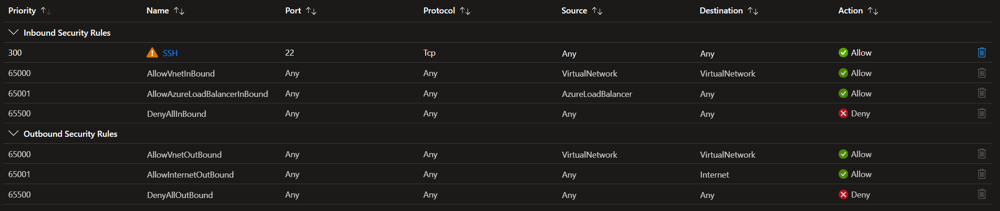

---

## Step 2 – Test Baseline SSH Access

Before making any changes to the NSG, SSH connectivity to the Linux VM was tested.

```bash
ssh -i ~/LinuxVM01-key.pem azureuser@<Public-IP>
```

### Observation

SSH connectivity was successful before applying any experimental NSG rules.

This established a baseline for the inbound traffic experiments.

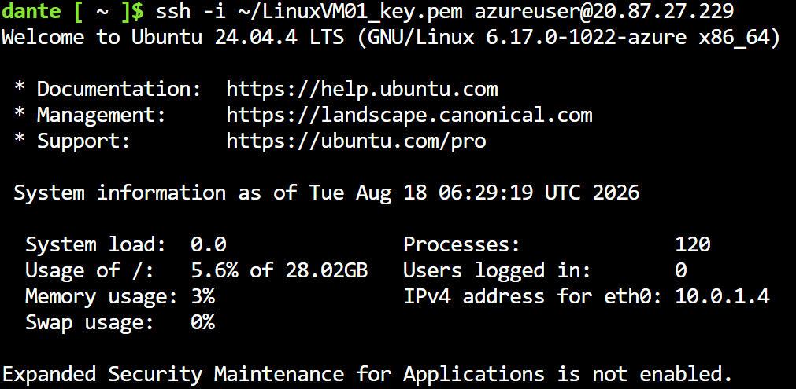

---

# 🧪 Experiments

## Experiment 1 – Block SSH

Created an inbound NSG rule to deny SSH traffic.

| Setting | Value |
|---|---|
| Source | Any |
| Source Port | `*` |
| Destination | Any |
| Destination Port | `22` |
| Protocol | TCP |
| Action | Deny |
| Priority | `100` |
| Name | Deny-SSH |

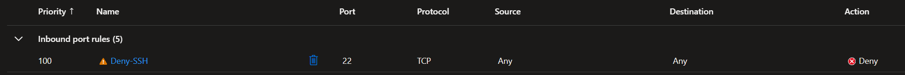

### Observation

Attempting to connect to the VM using SSH no longer established a connection.

The SSH client waited and eventually timed out.

```text
ssh: connect to host <Public-IP> port 22: Connection timed out
```

### 💡 Interesting Observation

An NSG denial can prevent the TCP connection from being established in the first place. This is different from an SSH authentication failure, where the VM is reachable but the credentials or SSH key are rejected.

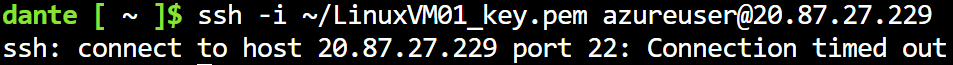

---

## Experiment 2 – Restore SSH Access

The SSH deny rule was removed and SSH access was restored.

An explicit allow rule was used to permit TCP traffic on port 22.

| Setting | Value |
|---|---|
| Source | Any |
| Destination Port | `22` |
| Protocol | TCP |
| Action | Allow |
| Priority | `100` |
| Name | Allow-SSH |

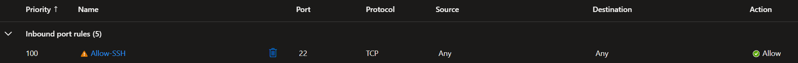

### Observation

SSH connectivity was successfully restored after the deny rule was removed and the allow rule was applied.

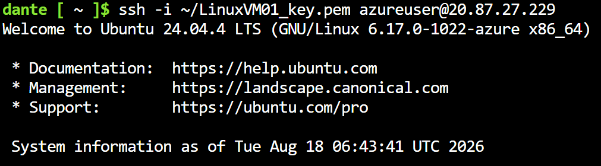

---

## Experiment 3 – NSG Rule Priority

Two rules were created that applied to the same SSH traffic.

### Rule 1

```text
Priority: 100
Action: Deny
Destination Port: 22
```

### Rule 2

```text
Priority: 200
Action: Allow
Destination Port: 22
```

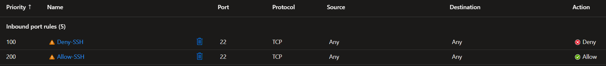

### Observation

SSH traffic was blocked.

The rule with priority **100** was evaluated before the rule with priority **200**.

```text
100 → Deny SSH   ← Matching rule
200 → Allow SSH
```

Once the matching deny rule was applied, the lower-priority allow rule did not override it.

### 💡 Interesting Observation

NSG rules are evaluated using their priority value. **A lower numerical value represents a higher priority.**

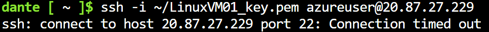

---

## Experiment 4 – Reverse the Rule Priorities

The rule priorities were changed:

```text
Allow SSH → 100
Deny SSH  → 200
```

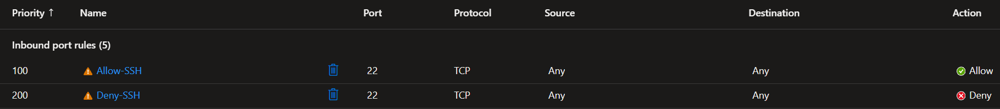

### Observation

SSH connectivity was restored.

The allow rule with priority **100** was evaluated before the deny rule with priority **200**.

```text
100 → Allow SSH   ← Matching rule
200 → Deny SSH
```

### Lesson Learned

When multiple NSG rules could apply to the same traffic, the rule with the **lowest numerical priority** is evaluated first.

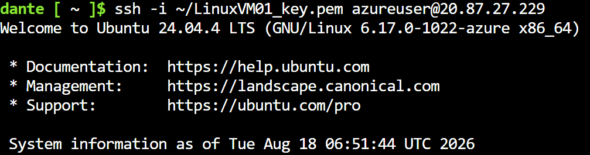

---

## Experiment 5 – Block HTTP

Nginx was installed on the Linux VM to provide a service listening on TCP port 80.

```bash
sudo apt update
sudo apt install nginx -y
```

The Nginx service was verified before applying the NSG rule.

An inbound NSG rule was then created to deny HTTP traffic.

| Setting | Value |
|---|---|
| Source | Any |
| Destination Port | `80` |
| Protocol | TCP |
| Action | Deny |
| Priority | `110` |
| Name | Deny-HTTP |

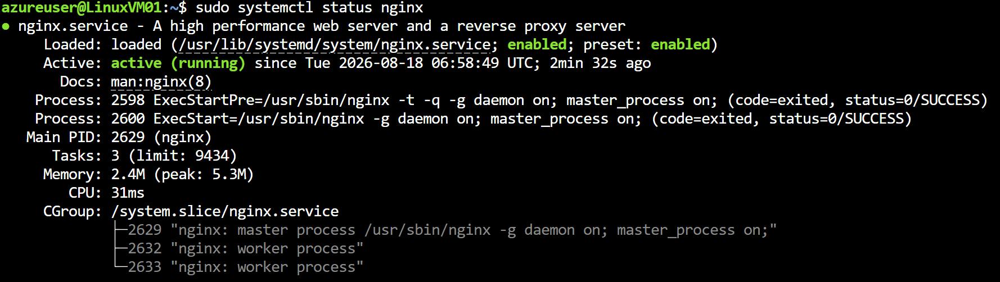

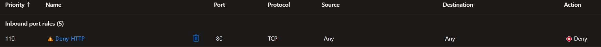

### Observation

The Nginx service was running on the VM, but accessing:

```text
http://<Public-IP>
```

was unsuccessful after the NSG deny rule was applied.

### 💡 Interesting Observation

The application can be running successfully on the VM while network traffic to the application's port is still blocked by an NSG.

```text
Internet
    │
    │ TCP/80
    ▼
   NSG
    │
    └── ❌ Deny
         │
       Nginx
```

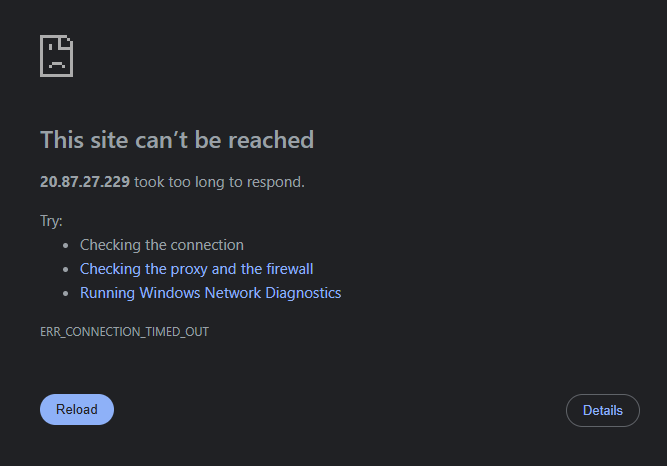

---

## Experiment 6 – Allow HTTP

The NSG rule was changed to allow HTTP traffic on TCP port 80.

| Setting | Value |
|---|---|
| Destination Port | `80` |
| Protocol | TCP |
| Action | Allow |

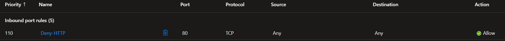

### Observation

The Nginx page became accessible through:

```text
http://<Public-IP>
```

This confirmed that the NSG was controlling access to the HTTP service.

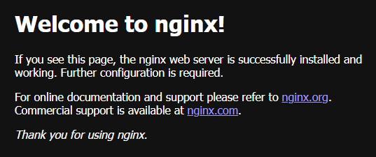

---

## Experiment 7 – Block Outbound HTTPS

An outbound NSG rule was created to deny HTTPS traffic.

| Setting | Value |
|---|---|
| Destination Port | `443` |
| Protocol | TCP |
| Action | Deny |
| Priority | `100` |

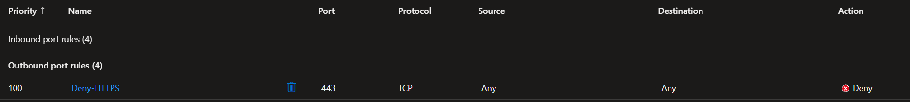

The following command was used to test outbound HTTPS connectivity:

```bash
curl -s -o /dev/null -w "HTTPS connection successful. HTTP status: %{http_code}\n" https://www.microsoft.com
```

### Observation

When outbound HTTPS was allowed, the command returned a successful HTTP response.

When the NSG rule denied TCP port 443, the HTTPS connection failed.

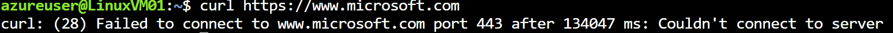

After removing the deny rule, outbound HTTPS connectivity was restored.

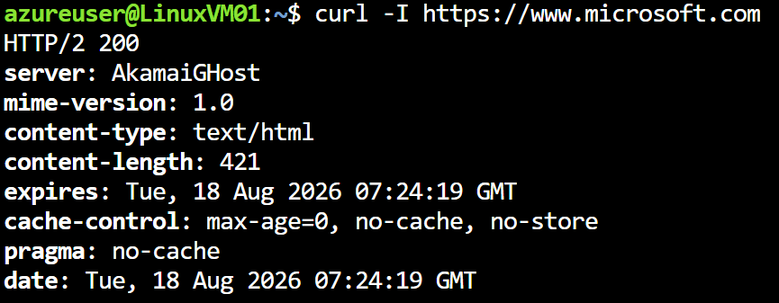

### 💡 Interesting Observation

NSGs can control both **inbound and outbound** network traffic.

---

## Experiment 8 – Inspect Default NSG Rules

The default inbound and outbound NSG rules were inspected.

Examples included:

```text
AllowVNetInBound
AllowAzureLoadBalancerInBound
DenyAllInBound

AllowVNetOutBound
AllowInternetOutBound
DenyAllOutBound
```

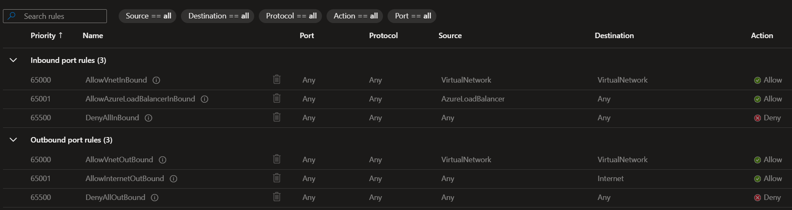

### 💡 Interesting Observation

Azure automatically creates default NSG rules. Custom NSG rules are evaluated before these default rules because custom rules have higher priority.

The default rules should not be deleted as part of this lab.

---

# 🛠️ Troubleshooting

## SSH Connection Timeout

### Issue

After creating the `Deny-SSH` inbound rule, the SSH client did not immediately return an error and appeared to remain connected while attempting to establish the connection.

### Cause

The NSG was blocking TCP traffic on port 22 before an SSH session could be established.

### Resolution

The SSH connection eventually timed out. The deny rule was then removed or replaced with an appropriate allow rule to restore SSH access.

### Lesson Learned

An NSG can prevent a connection from reaching the VM entirely. This produces different behavior from an SSH authentication failure such as:

```text
Permission denied (publickey)
```

---

# 📚 Lessons Learned

- An NSG controls inbound and outbound network traffic.
- NSGs can be associated with network interfaces and subnets.
- Inbound rules control traffic entering a resource.
- Outbound rules control traffic leaving a resource.
- NSG rules contain properties such as source, destination, protocol, port, priority, and action.
- Lower numerical priority values have higher priority.
- When multiple rules match the same traffic, the higher-priority matching rule determines the result.
- An NSG can block traffic even when the application running on the VM is functioning correctly.
- NSGs contain default inbound and outbound rules.
- Custom NSG rules are evaluated before the default rules.
- SSH uses TCP port 22.
- HTTP uses TCP port 80.
- HTTPS uses TCP port 443.
- NSG rules can be used to restrict access to specific services.
- Blocking SSH at the NSG level can cause the connection to time out rather than return an SSH authentication error.
- Network Security Groups provide network-level traffic control without requiring changes to the application itself.

---

# 💰 Cost Considerations

Network Security Groups do not incur a separate charge for the rules configured in this lab.

The Linux Virtual Machine and associated resources can incur charges while deployed.

The VM was stopped/deallocated after testing to avoid ongoing compute charges.

---

# 🔗 References

- [Microsoft Learn – Network Security Groups](https://learn.microsoft.com/azure/virtual-network/network-security-groups-overview)
- [Microsoft Learn – Filter Network Traffic with a Network Security Group](https://learn.microsoft.com/azure/virtual-network/tutorial-filter-network-traffic)
- [Microsoft Learn – Azure Network Security Group Default Rules](https://learn.microsoft.com/azure/virtual-network/network-security-groups-overview#default-security-rules)
