# Lab 05 – Azure Bastion

## 🎯 Objective

Deploy and configure Azure Bastion to securely administer an Azure Virtual Machine using its private IP address without exposing SSH directly to the Internet.

---

## Prerequisites

- Azure Subscription
- Azure Portal
- Existing Virtual Network from Lab 02
- Existing Linux Virtual Machine from Lab 03
- Existing Network Security Group from Lab 04
- SSH key pair

---

## Technologies

- Azure Bastion
- Azure Virtual Machines
- Azure Virtual Network
- Azure Subnets
- Network Security Groups
- SSH
- Public IP Address
- Private IP Address

---

## Lab Tasks

- [x] Review the existing VM networking configuration
- [x] Configure the AzureBastionSubnet
- [x] Deploy Azure Bastion
- [x] Explore the Bastion resource
- [x] Connect to the VM using Azure Bastion
- [x] Verify the VM's private IP connectivity
- [x] Remove the VM's Public IP
- [x] Connect to the VM without a Public IP
- [x] Test direct SSH connectivity
- [x] Review Network Security Group rules
- [x] Troubleshoot SSH key authentication

---

## 🏗️ Architecture

```text
Internet
   │
   │ HTTPS
   ▼
Azure Portal
   │
   ▼
Azure Bastion
   │
   │ Private VNet Connectivity
   ▼
VNet-Production
│
├── Frontend (10.0.1.0/24)
│      │
│      └── LinuxVM01
│             │
│             └── Private IP: 10.0.1.4
│
└── AzureBastionSubnet
       │
       └── Azure Bastion
```

---

# 🚀 Lab Steps

## Step 1 – Review Existing VM Configuration

Reviewed the existing `LinuxVM01` configuration before deploying Azure Bastion.

The VM was located in:

- **Resource Group:** RG-Networking
- **Virtual Network:** VNet-Production
- **Subnet:** Frontend
- **Operating System:** Ubuntu Linux

The VM was previously administered using SSH and a public IP address.

### 💡 Interesting Observation

Before Azure Bastion, the VM required direct SSH connectivity through its Public IP address.

Azure Bastion provides an alternative method of administration by connecting to the VM through its private IP address.

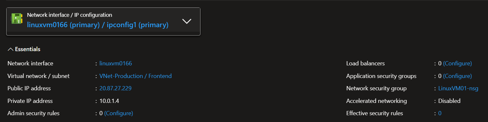

---

## Step 2 – Configure AzureBastionSubnet

Reviewed and configured the dedicated subnet required for Azure Bastion.

Azure Bastion requires a subnet with the exact name:

```text
AzureBastionSubnet
```

The subnet used in this lab was:

```text
10.0.10.0/26
```
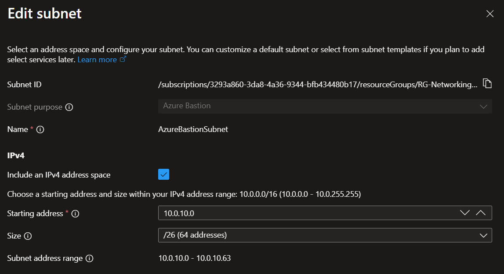

### 💡 Interesting Observation

Azure Bastion requires a dedicated subnet with the specific name `AzureBastionSubnet`.

This subnet cannot be used for normal Virtual Machine deployments.

The `/26` prefix provides sufficient address space for the Bastion deployment used in this lab.


---

## Step 3 – Deploy Azure Bastion

Deployed Azure Bastion into the existing `VNet-Production` Virtual Network.

The Bastion resource was configured using:

- **Resource Group:** RG-Networking
- **Virtual Network:** VNet-Production
- **Subnet:** AzureBastionSubnet
- **Region:** South Africa North

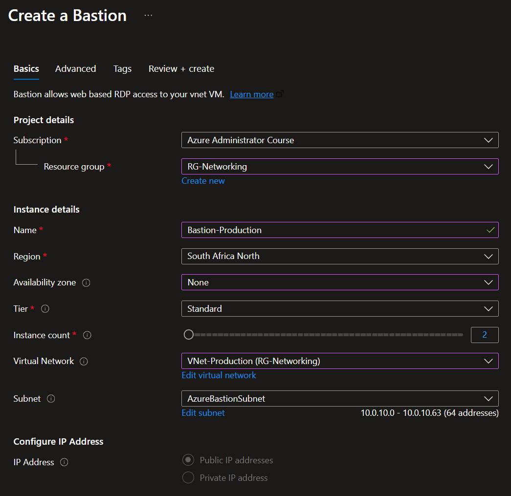

Azure Bastion also required a Public IP address.

### 💡 Important Observation

The Public IP address belongs to the Azure Bastion service rather than the Virtual Machine.

The connection path is:

```text
Internet
   │
   │ HTTPS
   ▼
Azure Bastion
   │
   │ Private Network
   ▼
LinuxVM01
```

This allows the VM to be administered without exposing SSH directly to the Internet.

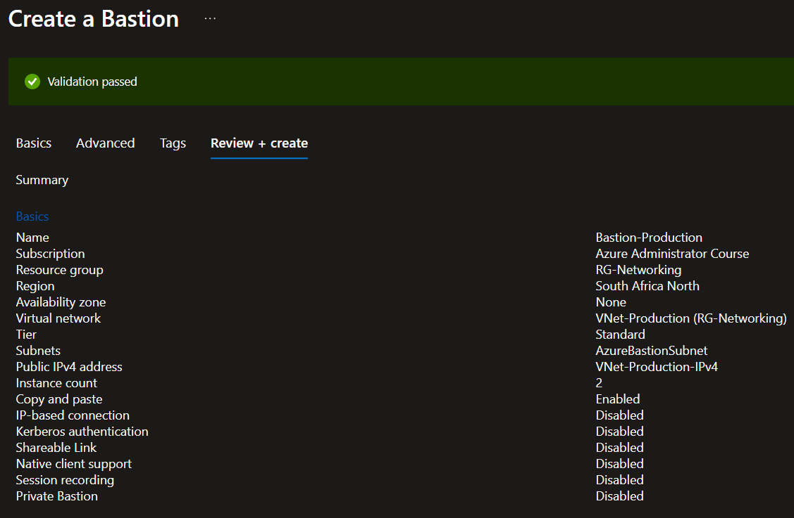

---

## Step 4 – Explore the Azure Bastion Resource

Reviewed the Azure Bastion resource after deployment.

The following configuration areas were explored:

- Provisioning state
- Virtual Network
- AzureBastionSubnet
- Public IP address
- IP configuration
- Connection options

### 💡 Interesting Observation

Azure Bastion is deployed as a dedicated Azure service inside the Virtual Network.

The Bastion resource uses its own Public IP for connectivity to the Azure Portal while communicating with Virtual Machines privately inside the Virtual Network.

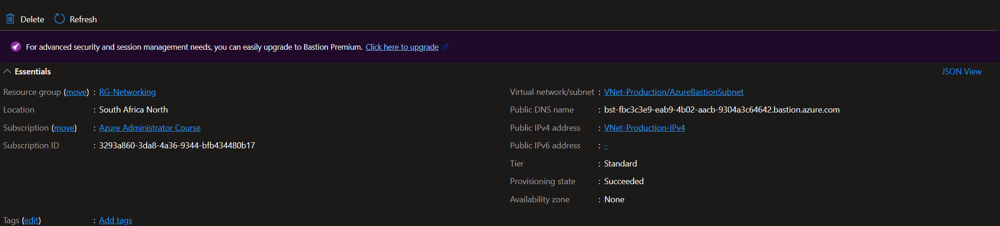

---

# 🧪 Experiments

## Experiment 1 – Connect to the VM Using Azure Bastion

Connected to `LinuxVM01` using the Azure Portal.

The connection was configured using:

- **Username:** azureuser
- **Authentication:** SSH Private Key
- **Private Key:** Matching `.pem` private key

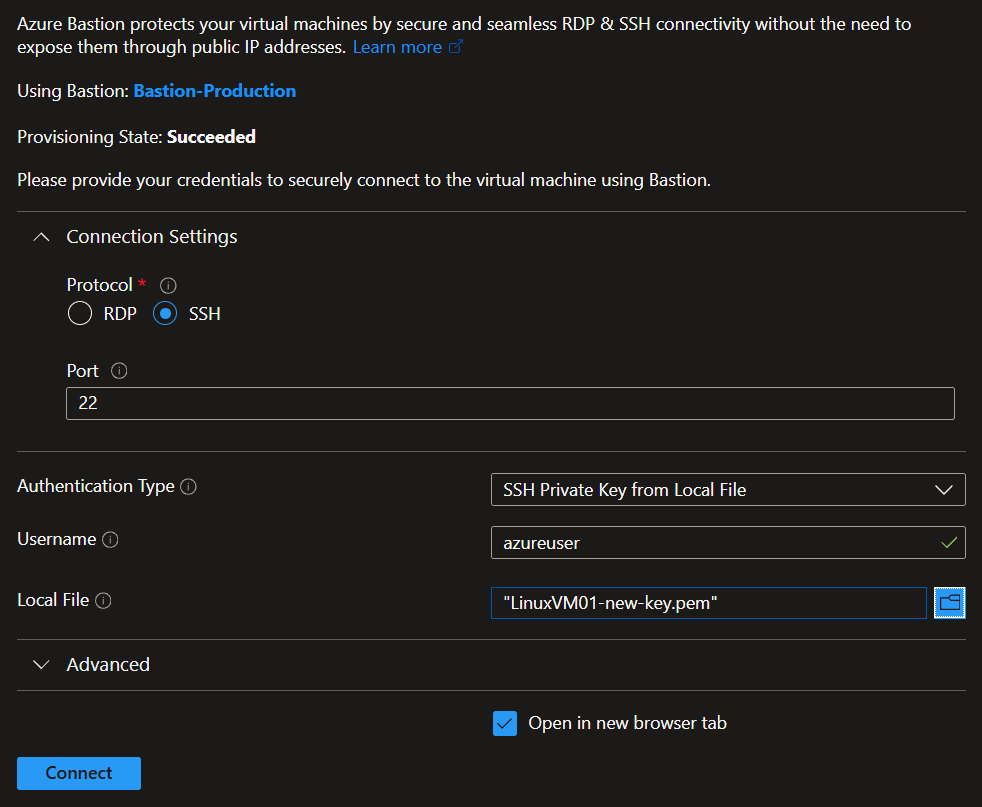

Azure Bastion opened an SSH session directly in the browser.

### Observation

The VM could be administered directly through the Azure Portal without using a traditional SSH client connected to the VM's Public IP.

### Lesson Learned

Azure Bastion provides browser-based SSH access to Linux Virtual Machines.

The administrative connection is routed through the Bastion service rather than directly exposing the VM to the Internet.

---

## Experiment 2 – Verify Private Connectivity

After connecting through Azure Bastion, the VM's hostname and network configuration were verified.

The following commands were used:

```bash
ip -4 addr
hostname
```

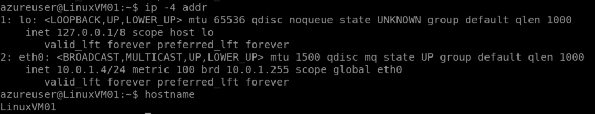

The results confirmed:

- **Hostname:** LinuxVM01
- **Network Interface:** eth0
- **Private IP:** 10.0.1.4/24

### Observation

The VM was successfully accessed through Azure Bastion using its private IP address.

### 💡 Interesting Observation

The VM remained accessible through Bastion using:

```text
Azure Bastion
      │
      ▼
Private IP
10.0.1.4
      │
      ▼
LinuxVM01
```

The Bastion connection did not require direct SSH access to the VM through the Internet.

### Lesson Learned

Azure Bastion communicates with Virtual Machines through private network connectivity within the Virtual Network.

---

## Experiment 3 – Remove the VM Public IP

Removed the Public IP association from the Linux Virtual Machine.

The VM retained its private IP address:

```text
10.0.1.4
```


The VM no longer had a Public IP address assigned.

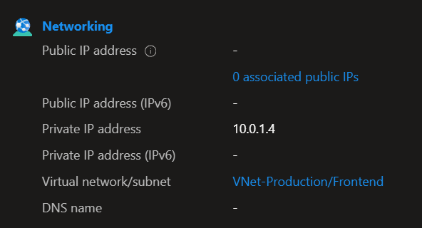

### Observation

Removing the Public IP prevented direct Internet connectivity to the VM.

However, the VM remained accessible through Azure Bastion.

### Lesson Learned

A Virtual Machine does not require its own Public IP address when Azure Bastion is used for administrative access.

This reduces the VM's exposure to the Internet.

---

## Experiment 4 – Connect Through Bastion Without a VM Public IP

After removing the VM's Public IP address, attempted another connection through Azure Bastion.

The connection was successful.

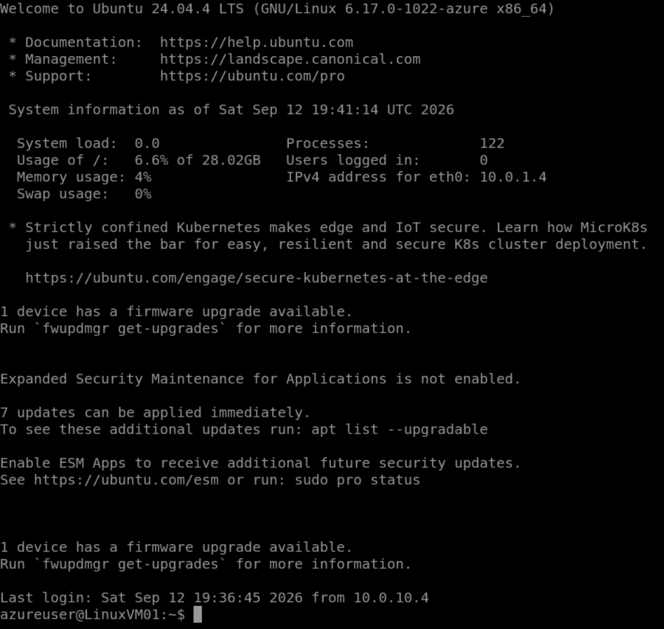

### Observation

Azure Bastion continued to provide SSH access to the VM even though the VM no longer had a Public IP address.

### 💡 Important Observation

The Bastion resource has a Public IP address, but the Virtual Machine does not require one.

```text
Internet
   │
   ▼
Bastion Public IP
   │
   ▼
Azure Bastion
   │
   ▼
VM Private IP
   │
   ▼
LinuxVM01
```

### Lesson Learned

Azure Bastion separates Internet-facing connectivity from the Virtual Machine.

The VM can remain private while still being securely administered.

---

## Experiment 5 – Test Direct SSH Connectivity

After removing the VM's Public IP address, direct SSH connectivity was tested.

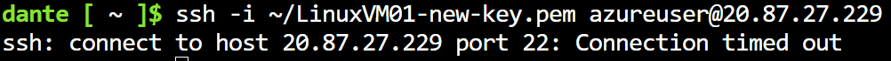

### Observation

Direct SSH access to the VM was no longer possible through the previous Public IP.

The VM could still be accessed through Azure Bastion.

### Lesson Learned

Removing a VM's Public IP eliminates direct Internet access to SSH.

Azure Bastion provides a secure alternative for remote administration.

---

## Experiment 6 – Azure Bastion Scope

Explored how Azure Bastion can provide connectivity to Virtual Machines within the Virtual Network.

### Observation

Azure Bastion is a shared administrative service and is not deployed individually for every Virtual Machine.

Conceptually, one Bastion resource can provide access to multiple Virtual Machines.

```text
                Azure Bastion
                     │
          ┌──────────┼──────────┐
          │          │          │
        VM01       VM02       VM03
```

### Lesson Learned

Azure Bastion can provide centralized secure administration for multiple Virtual Machines.

A separate Bastion deployment is not required for every VM.

---

## Experiment 7 – Inspect Network Security Group Rules

Reviewed the inbound security rules associated with the Virtual Machine.

The following default rules were present:

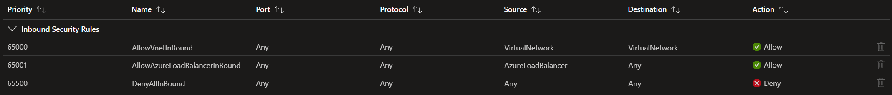

### Observation

The default `AllowVnetInBound` rule allows communication between resources within the Virtual Network.

Azure Bastion communicates with the VM using private network connectivity.

The `DenyAllInBound` rule blocks inbound traffic that is not explicitly permitted.

### Lesson Learned

Azure Bastion does not require the VM to expose SSH directly to the Internet.

The VM's NSG can continue to restrict inbound Internet traffic while allowing appropriate private network communication.

---

# 🛠️ Troubleshooting

## Azure Bastion Deployment in Incorrect Resource Group

### Issue

Azure Bastion was initially deployed into the incorrect Resource Group.

The Bastion deployment was created in a `NetworkWatcherRG` Resource Group instead of the intended `RG-Networking` Resource Group.

The Delete option was initially unavailable because the Bastion deployment was still in progress.

### Cause

The Azure Bastion deployment had not completed and was still in the `Deploying` state.

Azure prevents certain management operations while a resource deployment is actively running.

### Resolution

Waited for the deployment operation to complete.

The incorrectly deployed Bastion resource was then deleted and redeployed into the correct Resource Group:

```text
RG-Networking
```

### Lesson Learned

Azure resources can only be managed after conflicting deployment operations have completed.

Always verify the Resource Group and deployment configuration before creating more complex Azure resources.

---

## SSH Authentication Failure When Connecting Through Azure Bastion

### Issue

After deploying Azure Bastion and attempting to connect to `LinuxVM01` using an available private `.pem` key, the connection was unsuccessful.

The private key existed locally, but the corresponding public key was not configured for the `azureuser` account on the VM.

### Cause

The SSH public key associated with the available private key was not present in the VM's authorized SSH keys.

Azure Bastion was able to reach the VM, but SSH authentication required a matching public/private key pair.

### Resolution

Used the Azure Portal to add the SSH public key to the existing `azureuser` account:

1. Opened `LinuxVM01`.
2. Navigated to **Reset password**.
3. Selected **Add SSH public key**.
4. Selected **Use existing key stored in Azure**.
5. Selected the existing SSH key resource: `LinuxVM01_key`.
6. Applied the configuration update.
7. Reconnected to the VM through Azure Bastion using the matching private `.pem` key.

The Azure Bastion connection was then successful.

### Lesson Learned

Azure uses the **public SSH key** for authentication, while the user must possess the matching **private key**.

Having a `.pem` private key alone is not sufficient if its corresponding public key is not configured for the target user account on the VM.

---

# 📚 Lessons Learned

- Azure Bastion provides secure administrative access to Azure Virtual Machines.
- Azure Bastion supports SSH access to Linux VMs and RDP access to Windows VMs.
- Azure Bastion uses a dedicated subnet named `AzureBastionSubnet`.
- The VM does not require a Public IP address when using Azure Bastion.
- Azure Bastion communicates with Virtual Machines using private network connectivity.
- Azure Bastion uses its own Public IP address rather than exposing the VM directly.
- Direct SSH and RDP ports do not need to be exposed to the Internet.
- Azure Bastion can provide access to multiple Virtual Machines.
- Network Security Groups still control traffic to Virtual Machines.
- SSH authentication requires a matching public and private key pair.
- A public SSH key must be configured for the target user account on the VM.
- Removing unused Public IP addresses can reduce unnecessary Internet exposure.
- Azure Bastion is a billable service and should be reviewed when temporary lab infrastructure is no longer required.

---

# 💰 Cost Considerations

Azure Bastion is a billable Azure service.

For temporary lab environments:

- Delete Azure Bastion when it is no longer required.
- Delete unused Public IP addresses.
- Stop and deallocate Virtual Machines when not in use.
- Review associated networking resources for unnecessary charges.

The existing `VNet-Production` can be retained for future networking labs.

---

# References

- [Microsoft Learn – Azure Bastion](https://learn.microsoft.com/azure/bastion/)
- [Microsoft Learn – What is Azure Bastion?](https://learn.microsoft.com/azure/bastion/bastion-overview)
- [Microsoft Learn – Configure Azure Bastion](https://learn.microsoft.com/azure/bastion/tutorial-create-host-portal)
- [Microsoft Learn – Azure Bastion Architecture](https://learn.microsoft.com/azure/bastion/architecture)
- [Microsoft Learn – Connect to a Linux VM using Azure Bastion](https://learn.microsoft.com/azure/bastion/bastion-connect-vm-ssh)
- [Microsoft Learn – Azure Network Security Groups](https://learn.microsoft.com/azure/virtual-network/network-security-groups-overview)
