# Lab 06 – VNet Peering

## 🎯 Objective

Connect two Azure Virtual Networks using **VNet Peering** and verify private network connectivity between resources in the peered VNets.

This lab demonstrates:

- Creating a second Virtual Network
- Configuring non-overlapping address spaces
- Creating subnets
- Deploying a test VM
- Testing connectivity before peering
- Configuring VNet Peering
- Verifying peering status
- Testing connectivity after peering
- Understanding how NSGs continue to control traffic across peered VNets
- Understanding VNet Peering cost considerations

---

## Prerequisites

- Azure subscription
- Azure Portal access
- Existing `VNet-Production`
- Existing `LinuxVM01`
- Basic understanding of Azure VNets and subnets
- SSH access to Linux VMs

---

## Technologies

- Azure Virtual Network
- Azure VNet Peering
- Azure Virtual Machines
- Azure Subnets
- Network Security Groups
- Azure Cloud Shell
- SSH

---

## Lab Tasks

1. Create a second Virtual Network
2. Create a subnet in the new VNet
3. Deploy a test VM
4. Test connectivity before peering
5. Configure VNet Peering
6. Verify peering status
7. Test connectivity between the VNets
8. Test the effect of NSGs on peered traffic
9. Review VNet Peering cost considerations

---

## 🏗️ Architecture

The lab uses two separate Virtual Networks connected using VNet Peering.

```text
                 VNet Peering
        ┌─────────────────────────────┐
        │                             │
        ▼                             ▼

┌──────────────────────┐       ┌──────────────────────┐
│   VNet-Production    │       │      VNet-Test       │
│   10.0.0.0/16        │       │     10.1.0.0/16      │
│                      │       │                      │
│ Frontend             │       │ TestSubnet           │
│ 10.0.1.0/24          │       │ 10.1.1.0/24          │
│                      │       │                      │
│ LinuxVM01            │       │ Test VM              │
│ 10.0.1.4             │       │ 10.1.1.4             │
└──────────────────────┘       └──────────────────────┘

              RG-Networking
            South Africa North
```
# 🚀 Lab Steps

## Step 1 – Create the Test Virtual Network

A second Virtual Network was created for testing VNet Peering.

### Configuration

| Setting         | Value              |
| --------------- | ------------------ |
| Resource Group  | `RG-Networking`    |
| Virtual Network | `VNet-Test`        |
| Region          | South Africa North |
| Address Space   | `10.1.0.0/16`      |

The existing production VNet uses:

```text
VNet-Production
10.0.0.0/16
```

The two VNets therefore use different, non-overlapping address spaces.

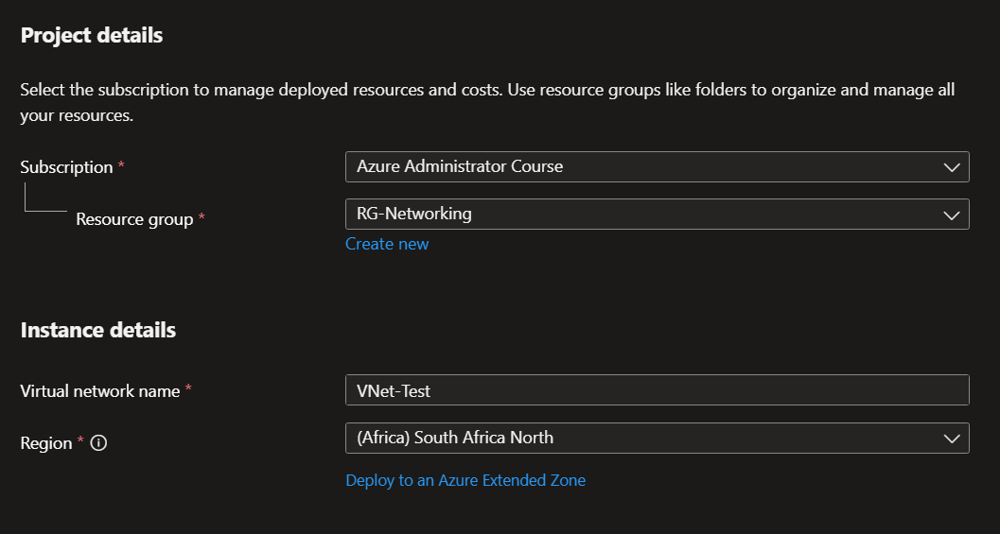

### 💡 Interesting Observation

The address spaces must not overlap if the VNets are going to be peered.

For example:

```text
VNet-Production
10.0.0.0/16

VNet-Test
10.1.0.0/16
```

These ranges do not overlap and can therefore be peered.

---

## Step 2 – Create the Test Subnet

A subnet was created inside `VNet-Test`.

| Setting       | Value         |
| ------------- | ------------- |
| Subnet Name   | `TestSubnet`  |
| Address Range | `10.1.1.0/24` |

The subnet provides 256 addresses:

```text
10.1.1.0 - 10.1.1.255
```

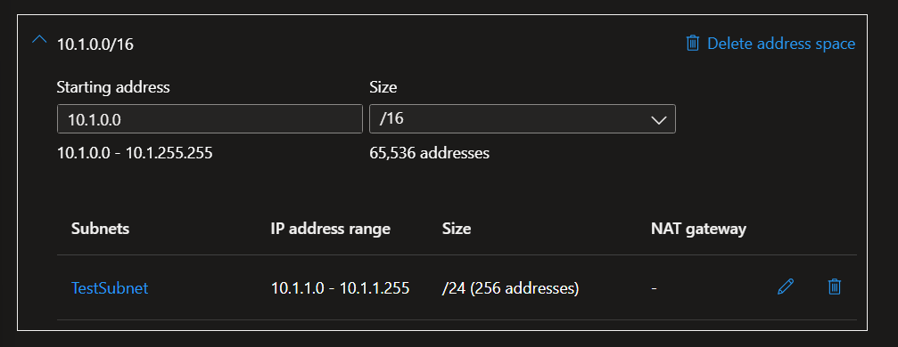

### 💡 Interesting Observation

The `/24` subnet is completely contained within the `10.1.0.0/16` VNet address space.

```text
VNet-Test
10.1.0.0/16

└── TestSubnet
    10.1.1.0/24
```

---

## Step 3 – Deploy the Test VM

A test Linux VM was deployed into `TestSubnet`.

The VM received the following private IP address:

```text
10.1.1.4
```

The existing production VM uses:

```text
LinuxVM01
10.0.1.4
```

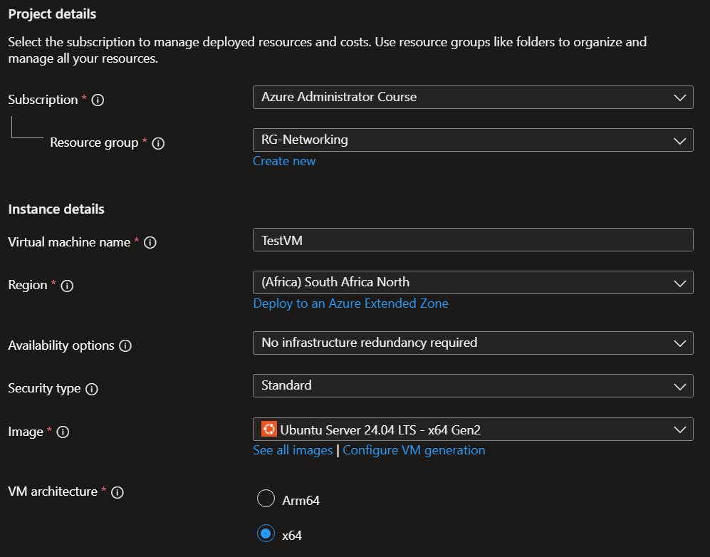

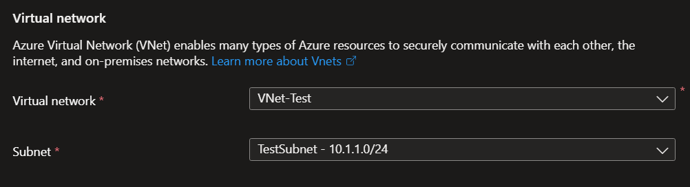

This provides a VM in each VNet that can be used to test private connectivity.

---

# 🧪 Experiments

## Experiment 1 – Test Connectivity Before Peering

Before configuring VNet Peering, connectivity between the two VNets was tested.

From `LinuxVM01` in `VNet-Production`:

```bash
ping 10.1.1.4
```

The result was:

```text
41 packets transmitted, 0 received, 100% packet loss
```

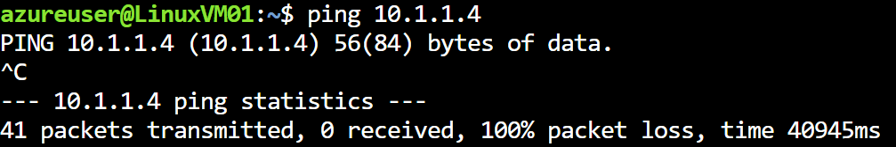

### Observation

The two VNets were not peered, so there was no private network path between:

```text
10.0.1.4
    ↓
10.1.1.4
```

### 💡 Interesting Observation

A failed ping alone does not prove that VNet Peering is missing because ICMP can also be blocked by an NSG or the guest operating system firewall.

For this reason, the test was used as a baseline rather than as definitive proof that peering was the only missing requirement.

---

## Experiment 2 – Test SSH Before Peering

SSH connectivity was also tested before peering.

```bash
ssh azureuser@10.1.1.4
```

The connection timed out:

```text
Connection timed out
```

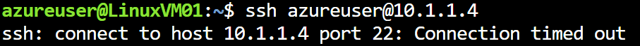

### Observation

The timeout provided another baseline showing that the Test VM could not be reached privately from `LinuxVM01` before peering.

After peering, SSH can be tested using the appropriate private key:

```bash
ssh -i ~/TestVM-key.pem azureuser@10.1.1.4
```

If networking is working but the SSH key is incorrect, an authentication error such as:

```text
Permission denied (publickey)
```

would indicate an authentication problem rather than a network connectivity problem.

---

## Experiment 3 – Configure VNet Peering

VNet Peering was configured between:

```text
VNet-Production
        ↕
VNet-Test
```

The peering links were configured as:

```text
Production-to-Test
Test-to-Production
```

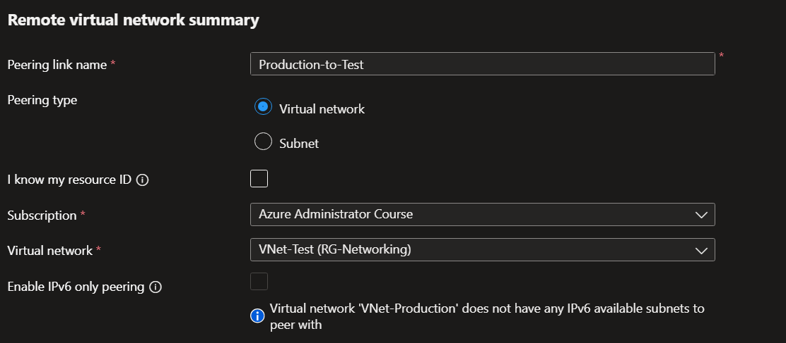

### Peering Settings

The following access settings were enabled:

```text
Allow 'VNet-Test' to access 'VNet-Production'

Allow 'VNet-Production' to access 'VNet-Test'
```

The following options were left disabled because they were not required for this lab:

```text
Allow forwarded traffic
Allow gateway or route server traffic
Use remote gateways
```

IPv6-only peering was also left disabled.

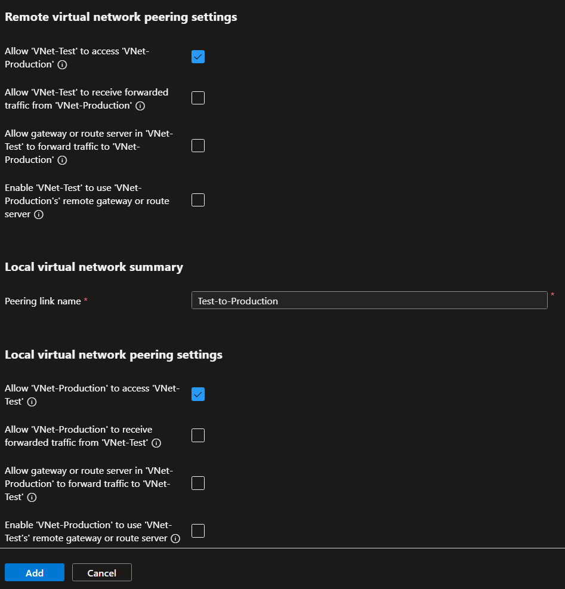

### 💡 Interesting Observation

VNet Peering provides private connectivity between the two VNets while existing network security controls continue to apply.

---

## Experiment 4 – Verify Peering Status

After the peering configuration was completed, both sides showed:

```text
Peering state: Connected
Peering sync: Fully Synchronized
```

### VNet-Production

```text
Peering:
Production-to-Test

State:
Connected

Sync:
Fully Synchronized
```

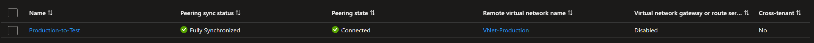

### VNet-Test

```text
Peering:
Test-to-Production

State:
Connected

Sync:
Fully Synchronized
```
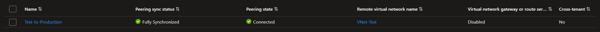

### 💡 Interesting Observation

Both sides should show a healthy peering state.

The important status values are:

```text
Connected
Fully Synchronized
```

This confirms that the peering relationship has been successfully established.

---

## Experiment 5 – Test Connectivity After Peering

After peering was established, connectivity between the VNet address spaces was tested.

From `LinuxVM01`:

```bash
ping 10.1.1.4
```

SSH can also be tested using the Test VM's private IP:

```bash
ssh -i ~/TestVM-key.pem azureuser@10.1.1.4
```

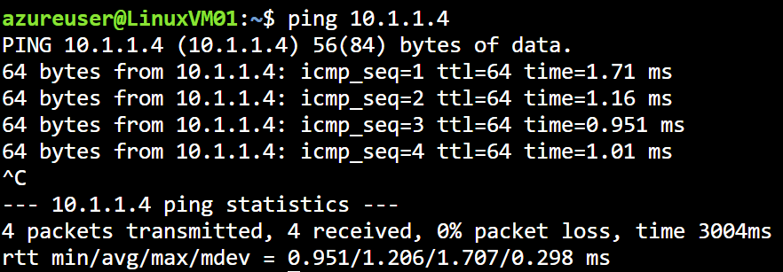
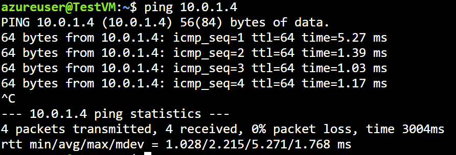

### Observation

VNet Peering provides a private network path between the two VNets.

The Test VM does not require a public IP address for communication with `LinuxVM01` across the peered VNets.

---

## Experiment 6 – NSGs Still Apply Across Peered VNets

VNet Peering does not bypass Network Security Groups.

Traffic between:

```text
VNet-Production
        ↓
VNet-Test
```

is still subject to the applicable NSG rules.

For example, if TCP port 22 is denied on the Test VM's NSG:

```text
LinuxVM01
10.0.1.4
     │
     │ TCP/22
     ▼
Test VM
10.1.1.4
     │
     └── NSG → Deny
```

SSH will fail even though the VNets are successfully peered.

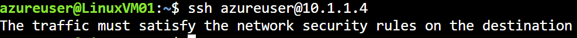

### 💡 Interesting Observation

VNet Peering provides connectivity; it does not automatically grant permission to communicate.

Network connectivity and security filtering are separate concepts.

---

## Experiment 7 – Address Space Considerations

The two VNets use non-overlapping address spaces:

```text
VNet-Production
10.0.0.0/16

VNet-Test
10.1.0.0/16
```

This is important because overlapping address spaces cannot be used for a normal VNet Peering configuration.

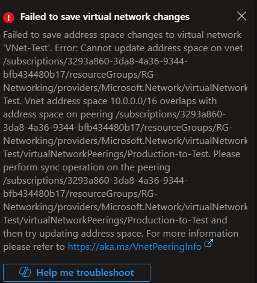

### 💡 Interesting Observation

Address planning should therefore be performed before creating VNets that may need to communicate with each other.

A poorly planned address space can create problems later when additional VNets need to be connected.

---

# 💰 Cost Considerations

Azure Virtual Networks themselves do not have a basic hourly charge.

However, resources associated with the network can generate costs.

| Resource        | Cost Consideration                           |
| --------------- | -------------------------------------------- |
| Virtual Network | No basic hourly charge                       |
| Subnets         | No charge                                    |
| VNet Peering    | Data transfer charges may apply              |
| Virtual Machine | Compute charges apply                        |
| Managed Disk    | Storage charges apply                        |
| Public IP       | May incur charges depending on configuration |

### VNet Peering

VNet Peering does not have a traditional hourly resource charge, but data transferred across peered VNets can incur data transfer charges.

For this lab, the amount of data generated by simple connectivity tests such as ping and SSH is very small.

The Test VM is therefore the more significant resource to consider when cleaning up the lab environment.

---

# 🛠️ Troubleshooting

## Ping Fails After Peering

If ping still fails after the peering state shows `Connected`, check:

1. Peering status on both VNets.
2. Test VM's NSG.
3. Linux firewall.
4. VM private IP address.
5. Route configuration.

Remember that ICMP may be blocked even when VNet Peering is functioning correctly.

---

## SSH Times Out After Peering

Check:

1. Peering state is `Connected`.
2. Test VM is running.
3. TCP port 22 is allowed by the Test VM's NSG.
4. The Linux firewall allows SSH.
5. The correct private IP is being used.

Example:

```bash
ssh -i ~/TestVM-key.pem azureuser@10.1.1.4
```

---

## SSH Returns `Permission denied (publickey)`

If the connection reaches the VM but authentication fails:

```text
Permission denied (publickey)
```

the network path is working.

Check that the correct private SSH key is being used:

```bash
ssh -i ~/TestVM-key.pem azureuser@10.1.1.4
```

This is different from:

```text
Connection timed out
```

A timeout generally indicates that the connection is not successfully reaching the SSH service.

---

# 📚 Lessons Learned

- Azure VNets are logical private networks within Azure.
- VNet Peering connects separate VNets using private network connectivity.
- VNets being peered must use non-overlapping address spaces.
- VNet Peering can connect VNets in the same region or across regions.
- Peering creates a private network path between the VNets.
- Resources can communicate using their private IP addresses across a peered connection.
- VNet Peering does not bypass NSGs.
- Network connectivity and security filtering are separate concepts.
- Both sides of a peering relationship should show `Connected` and `Fully Synchronized`.
- VNet Peering itself has no basic hourly charge, but data transferred across the peering can incur charges.
- VNets and subnets themselves do not incur a basic usage charge.
- Resources deployed inside the VNets, particularly VMs, can generate ongoing costs.

# References

- [Microsoft Learn – Azure Virtual Network Peering](https://learn.microsoft.com/azure/virtual-network/virtual-network-peering-overview)
- [Microsoft Learn – Create, change, or delete an Azure virtual network peering](https://learn.microsoft.com/azure/virtual-network/virtual-network-manage-peering)
- [Microsoft Learn – Azure Virtual Network documentation](https://learn.microsoft.com/azure/virtual-network/)
- [Microsoft Learn – Network Security Groups](https://learn.microsoft.com/azure/virtual-network/network-security-groups-overview)
- [Microsoft Azure – Virtual Network Pricing](https://azure.microsoft.com/pricing/details/virtual-network/)

